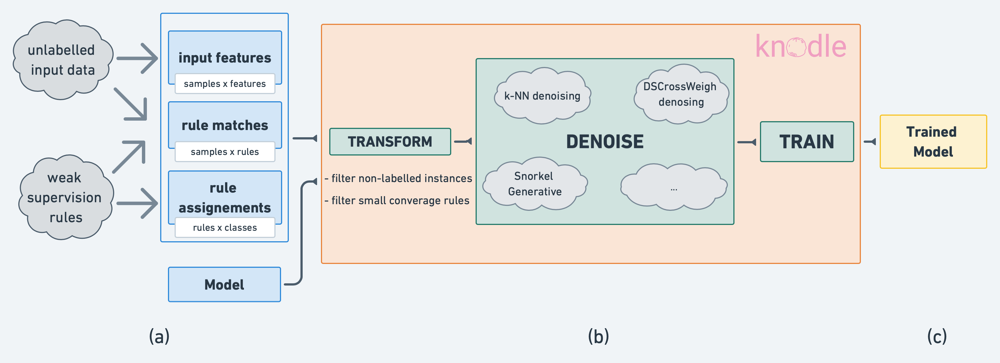

[](https://www.python.org/downloads/release/python-360/)
[](https://opensource.org/licenses/Apache-2.0)
[]()
[](https://github.com/knodle/knodle/actions?branch=style_guide)

[](https://codecov.io/gh/knodle/knodle)
    
    
Knodle (_Knowledge-supervised Deep Learning Framework_) - a new framework for weak supervision with neural networks. It provides a modularization for separating weak data annotations, powerful deep learning models, and methods for improving weakly supervised training.

More details about Knodle are in our recent [paper](https://arxiv.org/abs/2104.11557). 

****
### Latest news
- **June 2021:** Our paper was accepted on [ACL 2021 RepL4NLP Workshop](https://sites.google.com/view/repl4nlp-2021/home).  
- **Apr 2021: Knodle first release! :rocket:**
- **Apr 2021:** Anastasiia Sedova, Andreas Stephan, Marina Speranskaya, Benjamin Roth. [Knodle: Modular Weakly Supervised Learning with PyTorch](https://arxiv.org/abs/2104.11557) (preprint).

## Installation

```
pip install knodle
```

## Usage

knodle offers various methods for denoising weak supervision sources and improve them. There are several methods available for denoising. Examples can be seen in the tutorials folder.

There are four mandatory inputs for knodle:

1. `model_input_x`: Your model features (e.g. TF-IDF values) without any labels. Shape: (n_instances x features)
2. `mapping_rules_labels_t`: This matrix maps all weak rules to a label. Shape: (n_rules x n_classes)
3. `rule_matches_z`: This matrix shows all applied rules on your dataset. Shape: (n_instances x n_rules)
4. `model`: A PyTorch model which can take your provided `model_input_x` as input. Examples are in the [model folder](https://github.com/knodle/knodle/tree/develop/knodle/model/).

If you know which denoising method you want to use, you can directly call the corresponding module (the list of currently supported methods is provided [below](https://github.com/knodle/knodle/tree/style_guide#denoising-methods)).

Example for training the baseline classifier:

```python
from knodle.model.logistic_regression_model import LogisticRegressionModel
from knodle.trainer.baseline.majority import MajorityVoteTrainer

NUM_OUTPUT_CLASSES = 2

model = LogisticRegressionModel(model_input_x.shape[1], NUM_OUTPUT_CLASSES)

trainer = MajorityVoteTrainer(
  model=model,
  mapping_rules_labels_t=mapping_rules_labels_t,
  model_input_x=model_input_x,
  rule_matches_z=rule_matches_z,
  dev_model_input_x=X_dev,
  dev_gold_labels_y=Y_dev
)

trainer.train()

trainer.test(X_test, Y_test)
```

A more detailed example of classifier training is [here](https://github.com/knodle/knodle/blob/develop/examples/trainer/simple_auto_trainer/auto_trainer_tutorial.ipynb).  

## Main Principles

The framework provides a simple tensor-driven abstraction based on PyTorch allowing researchers to efficiently develop and compare their methods. The emergence of machine learning software frameworks is the biggest enabler for the wide spread adoption of machine learning and its speed of development. With Knodle we want to empower researchers in a similar fashion.

Knodle main goals:
- *Data abstraction*. The interface is a tensor-driven data abstraction which unifies a large number of input
variants and is applicable to a large number of tasks.
- *Method independence*. We distinguish between weak supervision and prediction model. This enables comparability and accounts for a domain-specific inductive biases.
- *Accessibility*. There is a high-level access to the library, that makes it easy to test existing methods, incorporate new ones and benchmark them against each other.




Apart from that, Knodle includes a selection of well-known data sets from prior work in weak supervision. Knodle ecosystem provides modular access to datasets and denoising methods (that can, in turn, be combined with arbitrary deep learning models), enabling easy experimentation.

Datasets currently provided in Knodle:

- Spam Dataset - a dataset, based on the YouTube comments dataset from [Alberto et al. (2015)](https://www.researchgate.net/publication/300414679_TubeSpam_Comment_Spam_Filtering_on_YouTube). Here, the task is to classify whether a text is relevant to the video or holds spam, such as adver- tisement.
- Spouse Dataset - relation extraction dataset is based on the Signal Media One-Million News Articles Dataset from [Corney et al. (2016)](http://ceur-ws.org/Vol-1568/paper8.pdf). 
- IMDb Dataset - a dataset, that consists of short movie reviews. The task is to determine whether a review holds a positive or negative sentiment. 
- TAC-based Relation Extraction Dataset - a dataset built over Knowledge Base Population challenges in the Text Analysis Conference. For development and test purposes the corpus annotated via crowdsourcing and human labeling from KBP is used ([Zhang et al. (2017)](https://www.aclweb.org/anthology/D17-1004.pdf). The training is done on a weakly-supervised noisy dataset based on TAC KBP corpora ([Surdeanu (2013)](https://tac.nist.gov/publications/2013/additional.papers/KBP2013_English_and_Temporal_Slot_Filling_overview.TAC2013.proceedings.pdf)). 

All datasets are added to the Knodle framework in the tensor format described above and could be dowloaded [here](http://knodle.dm.univie.ac.at/minio/knodle/datasets/).
To see how the datasets were created please have a look at the [dedicated tutorial](https://github.com/knodle/knodle/tree/develop/examples/data_preprocessing).


## Denoising Methods

There are several denoising methods available.

| Trainer Name         | Module                               | Description                                                                                                                                                                                                   |
| -------------------- | -------------------------------------| ------------------------------------------------------------------------------------------------------------------------------------------------------------------------------------------------------------- |
| MajorityVoteTrainer  |`knodle.trainer.baseline`             | This builds the baseline for all methods. No denoising takes place. The final label will be decided by using a simple majority vote approach and the provided model will be trained with these labels.        |
| AutoTrainer          |`knodle.trainer`                      | This incorporates all denoising methods currently provided in Knodle. |
| KNNAggregationTrainer|`knodle.trainer.knn_aggregation`      | This method looks at the similarities in sentence values. The intuition behind it is that similar samples should be activated by the same rules which is allowed by a smoothness assumption on the target space. Similar sentences will receive the same label matches of the rules. This counteracts the problem of missing rules for certain labels. |
| WSCrossWeighTrainer  |`knodle.trainer.wscrossweigh`         | This method weighs the training samples basing on how reliable their labels are. The less reliable sentences (i.e. sentences, whose weak labels are possibly wrong) are detected using a DS-CrossWeigh method, which is similar to k-fold cross-validation, and got reduced weights in further training. This counteracts the problem of wrongly classified sentences. |
| SnorkelTrainer       |`knodle.trainer.snorkel`              | A wrapper of the Snorkel system, which incorporates both generative and discriminative Snorkel steps in a single call.  |

Each of the methods has its own default config file, which will be used in training if no custom config is provided. 

## Details about negative samples

## Tutorials

We also aimed at providing the users with basic tutorials that would explain how to use our framework. All of them are stored in [examples](https://github.com/knodle/knodle/tree/develop/examples/) folder and logically divided into two groups:
- tutorials that demonstrate how to prepare the input data for Knodle Framework...
    - ... on the example of a well-known ImdB dataset. A weakly supervised dataset is created by incorporating keywords as weak sources ([link](https://github.com/knodle/knodle/tree/develop/examples/data_preprocessing/imdb_dataset)).
    - ... on the example of a TAC-based dataset in .conll format. A relation extraction dataset is created using entity pairs from Freebase as weak sources ([link](https://github.com/knodle/knodle/tree/develop/examples/data_preprocessing/tac_based_dataset)).
- tutorials how to work with Knodle Framework...
    - ... on the example of AutoTrainer. This trainer is to be called when user wants to train a weak classifier, but has no intention to use any specific denoising method, but rather try all currently provided in Knodle ([link](https://github.com/knodle/knodle/tree/develop/examples/trainer/autotrainer)).
    - ... on the example of WSCrossWeighTrainer. With this trainer a weak classifier with WSCrossWeigh denoising method will be trained ([link](https://github.com/knodle/knodle/tree/develop/examples/trainer/WSCrossWeigh)).

## Compatibility

Currently the package is tested on Python 3.7. It is possible to add further versions. The CI/CD pipeline needs to be updated in that case.

## Structure

The structure of the code is as follows
```
knodle
├── knodle
│    ├── evaluation
│    ├── model
│    ├── trainer
│          ├── baseline
│          ├── knn_aggregation
│          ├── snorkel
│          ├── wscrossweigh
│          └── utils
│    ├── transformation
│    └── utils
├── tests
│    ├── data
│    ├── evaluation
│    ├── trainer
│          ├── baseline
│          ├── wscrossweigh
│          ├── snorkel
│          └── utils
│    └── transformation
└── examples
     ├── data_preprocessing
           ├── imdb_dataset
           └── tac_based_dataset
     └── training
           ├── simple_auto_trainer
           └── wscrossweigh

```

## License

Licensed under the [Apache 2.0 License](LICENSE).

## Contact

If you notices a problem in the code, you can report it by [submitting an issue](<https://github.com/knodle/kndole/issues/new>).

If you want to share your feedback with us or take part in the project, contact us via 
<knodle@cs.univie.ac.at>. 

And don't forget to follow [@knodle_ai](https://twitter.com/knodle_ai) on Twitter :)

## Authors

- [Anastasiia Sedova](https://github.com/agsedova)
- [Andreas Stephan](https://github.com/AndSt)
- [Marina Speranskaya](https://github.com/marina-sp) 
- [Alessandro Volpicella](https://github.com/AlessandroVol23)
- [Benjamin Roth](https://www.benjaminroth.net/)

## Citation

```
@misc{sedova2021knodle,
      title={Knodle: Modular Weakly Supervised Learning with PyTorch}, 
      author={Anastasiia Sedova, Andreas Stephan, Marina Speranskaya, and Benjamin Roth},
      year={2021},
      eprint={2104.11557},
      archivePrefix={arXiv},
      primaryClass={cs.LG}
}
```

## Acknowledgments

This research was funded by the WWTF though the project “Knowledge-infused Deep Learning for Natural Language Processing” (WWTF Vienna Research Group VRG19-008).
