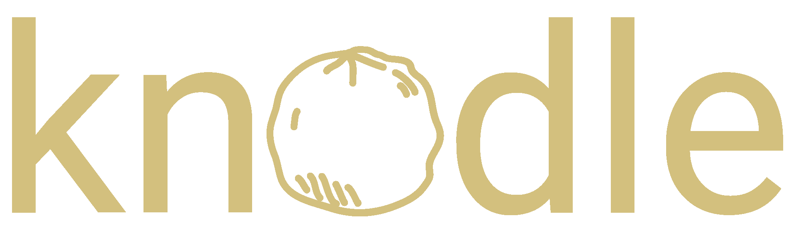

### Knowledge infused deep learning framework

[](https://www.python.org/downloads/release/python-360/)
[](https://opensource.org/licenses/Apache-2.0)

## Installation

`pip install knodle`

## Usage

knodle offers various methods for denoising weak supervision sources and improve them. There are several methods available for denoising. Examples can be seen in the tutorials folder.

There are four mandatory inputs for knodle:

1. `model_input_x`: Your model features (e.g. TFIDF values) without any labels. Shape: n_instances x features
2. `mapping_rules_labels_t`: This matrix maps all weak rules to a label. Shape: n_rules x n_classes
3. `rule_matches_z`: This matrix shows all applied rules on your dataset. Shape: n_instances x n_rules
4. `model`: A PyTorch model which can take your provided `model_input_x` as input. Examples are in the [model folder](https://github.com/knodle/knodle/tree/develop/knodle/model/).

Example for training the baseline classifier:

```python
from knodle.model import LogisticRegressionModel
from knodle.trainer import TrainerConfig
from knodle.trainer.baseline.baseline import NoDenoisingTrainer
from knodle.data import get_imdb_dataset

OUTPUT_CLASSES = 2

model_input_x, mapping_rules_labels_t, rule_matches_z = get_imdb_dataset()

model = LogisticRegressionModel(model_input_x.shape[1], OUTPUT_CLASSES)

trainer = SimpleDsModelTrainer(
  model,
  mapping_rules_labels_t=mapping_rules_labels_t,
  model_input_x=train_dataset,
  rule_matches_z=train_rule_matches_z
)

trainer.train()

trainer.test(test_features=test_tfidf, test_labels=Tensor(y_test))
```

For seeing how the imdb dataset was created please have a look at the [dedicated tutorial](https://github.com/knodle/knodle/tree/develop/tutorials/ImdbDataset).

## Denoising Methods

There are several denoising methods available.

| Name                 | Module                                  | Description                                                                                                                                                                                                   |
| -------------------- | --------------------------------------- | ------------------------------------------------------------------------------------------------------------------------------------------------------------------------------------------------------------- |
| Baseline             | `knodle.trainer.baseline`               | This builds the baseline for all methods. No denoising takes place. The final label will be decided by using a simple majority vote approach and the provided model will be trained with these labels.        |
| kNN TFIDF Similarity | `knodle.trainer.knn_tfidf_similarities` | This method looks at the similarities in tfidf values of the sentences. Similar sentences will receive the same label matches of the rules. This counteracts the problem of missing rules for certain labels. |
| DSCrossWeigh         | `knodle.trainer.crossweigh`             | This method weighs the training samples basing on how reliable their labels are. The less reliable sentences (i.e. sentences, whose weak labels are possibly wrong) are detected using a CrossWeigh method, which is similar to k-fold cross-validation, and got reduced weights in further training. This counteracts the problem of wrongly classified sentences. |

## Tutorials

The folder [tutorials](https://github.com/knodle/knodle/tree/develop/tutorials/) has different tutorials:

1. [IMDB Dataset Creation](https://github.com/knodle/knodle/tree/develop/tutorials/ImdbDataset): Shows how to create a weakly supervised dataset by incorporating keywords as weak sources.
2. [Relation Extraction Dataset](https://github.com/knodle/knodle/tree/develop/tutorials/RelationExtractionDataset): Shows the process of creating a dataset with the CONLL dataset.
3. [Baseline Training](https://github.com/knodle/knodle/tree/develop/tutorials/baseline_training_example): Shows the example process of training a baseline classifier.
4. [KNN Similarity Trainer](https://github.com/knodle/knodle/tree/develop/tutorials/knn_tfidf_similarity_example): Shows an example of how to use the denoising method of knn for training a weak classifier.

## Compatibility

Currently the package will be tested on Python 3.7. It is possible to add further versions. The CI/CD pipeline needs to be updated in that case.

## License

Licensed under the [Apache 2.0 License](LICENSE).

## Authors

- [Benjamin Roth](https://www.benjaminroth.net/)
- [Anastasiia Sedova](https://github.com/agsedova)
- [Alessandro Volpicella](https://github.com/AlessandroVol23)
- Andreas Stephan
